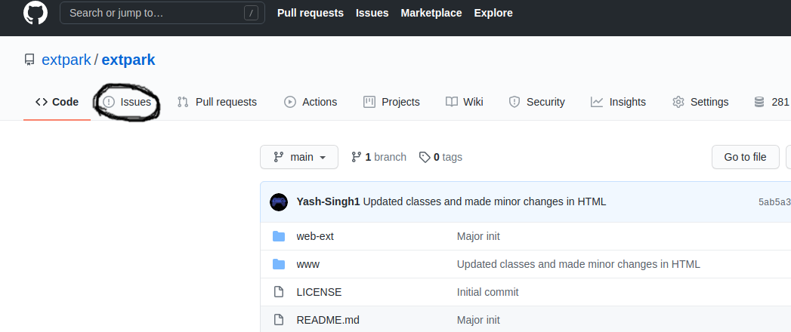
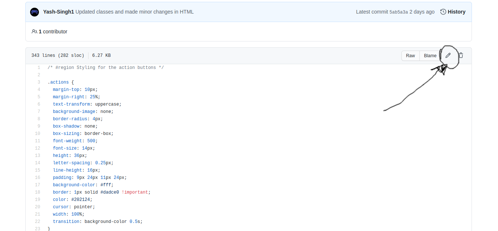
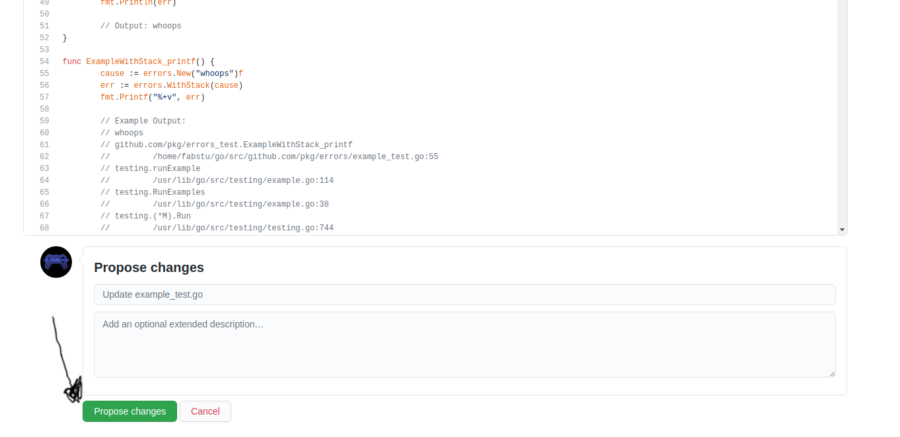
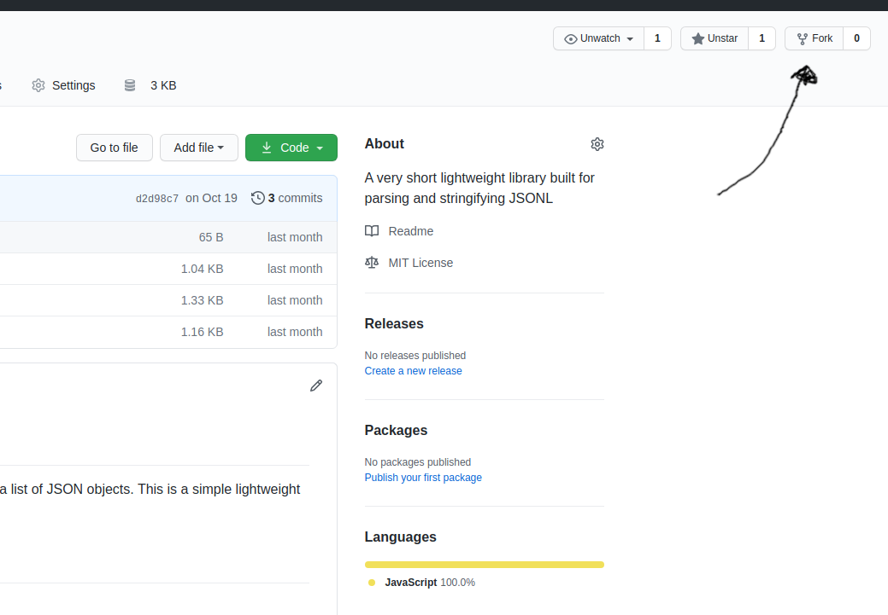
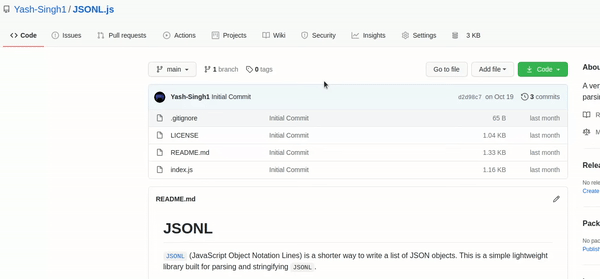

# Contributing Guidelines

This repository welcomes all contributions,
whether it is a typo fix or a breaking change, or a performance issue.
Here are the steps for contributing:

## Issues

If you have found a bug in the repository or think there can be an enhancement,
go to the `Issues` panel in the top left:

In the top right there will be an option to create an issue.

## Pull Request

Pull requests allow you to suggest new changes.
There are multiple ways of creating pull requests.

### Minor Changes

If you are simply deleting, renaming, creating, or modifying a file:

1. View that file inside `Github`
2. Click on the edit icon in the top right to edit the file:
   

3. This will automatically fork the repository and create a `patch-ID` branch where `ID` will be the number of the next `patch` branch available.
   Make your changes then press the `Propose Changes` button:
   

4. Now you can review your changes and create a pull request, it will soon be reviewed by a maintainer

### Major Changes

When proposing major changes, the above method can be inefficient and tiring. The `GitHub` IDE doesn’t have the best features possible.
In these scenarios, making your changes locally will be the best option.
Locally, you can also run the extension and the web app in development mode. Here are the steps for making major changes:

1. Make sure you have `git`, `google-chrome`, `npm`, and `node` installed. At times, `nvm` also helps (NOTE: `nvm` is not required)
2. Fork the repository by clicking on the button on the top right labeled "Fork":
   
3. Now copy the link to your codebase:

   

4. Inside the terminal, run: `git clone URL` and replace `URL` with the URL that you previously copied
5. Make your changes from your choice’s code editor. Look at the [development](#development) section for more tips on developing
6. Once you are done, run `git add .` and `git commit -m MSG` replacing `MSG` with your commit message
7. Now you can go ahead and run `git push` to push the changes to **your fork** of the repository
8. We are not done yet! The changes are only on your fork.
   To create a pull request on the repository, click on the pull request button underneath the "Code" option shown in the previous GIF
9. Now you can write out your elaborated pull request message and click on "Create Pull Request"
10. Your PR will soon be reviewed

## Development

For the directory structure, look [here](docs/setup.md#directory-structure). Here is a [quick explanation](/ARCHITECTURE.md) of the extension.

Here are some `npm` scripts that are useful:

- `start` - The `start` command starts up the servers. See the [setup instructions](docs/setup.md) for more information
- `lint` - The `lint` command checks for any linting errors using `prettier`. Run `npm run lint` at the root to find any errors
- `code-style` - The `code-style` command will remove linting errors and fix the styling using `prettier`
- `dev` - Creates a folder called `dist/` that can be used for loading the extension
- `build` - Runs the `dev` script and zips the resulting `dist/` directory
